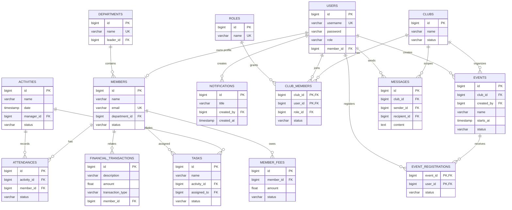

# Thiết kế Cơ sở dữ liệu Hệ thống Quản lý Câu lạc bộ Sinh viên

> **Phiên bản:** 1.0  
> **Nguyên tắc:** Mô tả chính xác các SQLAlchemy model hiện có trước, sau đó tách riêng phần schema mở rộng.  
> **Lưu ý:** `Base.metadata.create_all()` tạo bảng mới nhưng không tự migrate các bảng đã tồn tại; thay đổi schema production cần migration tool.

## 1. Tổng quan

Thiết kế sử dụng cơ sở dữ liệu quan hệ. Phiên bản hiện tại của backend đang dùng SQLite với SQLAlchemy; có thể chuyển sang PostgreSQL bằng cách thay đổi cấu hình kết nối.

Các bảng nghiệp vụ hiện có trong mã nguồn:

- `users`
- `members`
- `departments`
- `activities`
- `attendances`
- `tasks`
- `notifications`
- `ai_requests`
- `faqs`
- `scheduled_posts`
- `financial_transactions`
- `member_fees`

Các bảng được đề xuất để hoàn thiện mô hình nhiều CLB:

- `clubs`
- `roles`
- `club_members`
- `events`
- `event_registrations`
- `messages`

## 2. Các bảng hiện đang triển khai

### 2.1. `users`

| Cột | Kiểu dữ liệu | Ràng buộc | Mô tả |
|---|---|---|---|
| `id` | INTEGER | PK, INDEX | Định danh tài khoản. |
| `username` | VARCHAR(50) | UNIQUE, NOT NULL | Tên đăng nhập. |
| `password` | VARCHAR(255) | NOT NULL | Mật khẩu đã băm. |
| `role` | VARCHAR(20) | NOT NULL | `chu_nhiem`, `truong_ban` hoặc `thanh_vien`. |
| `member_id` | INTEGER | FK -> `members.id`, NULL | Hồ sơ thành viên gắn với tài khoản. |

### 2.2. `members`

| Cột | Kiểu dữ liệu | Ràng buộc | Mô tả |
|---|---|---|---|
| `id` | INTEGER | PK, INDEX | Định danh thành viên. |
| `name` | VARCHAR(100) | NOT NULL | Họ tên. |
| `email` | VARCHAR(100) | UNIQUE, NOT NULL | Email liên hệ. |
| `phone` | VARCHAR(20) | NULL | Số điện thoại. |
| `department_id` | INTEGER | FK -> `departments.id`, NULL | Ban chuyên môn. |
| `skills` | TEXT | NULL | Danh sách kỹ năng. |
| `availability` | TEXT | NULL | Lịch rảnh. |
| `join_date` | DATETIME | NULL | Ngày tham gia. |
| `status` | VARCHAR(20) | DEFAULT `active` | Trạng thái hoạt động. |

### 2.3. `departments`

| Cột | Kiểu dữ liệu | Ràng buộc | Mô tả |
|---|---|---|---|
| `id` | INTEGER | PK, INDEX | Định danh ban. |
| `name` | VARCHAR(100) | UNIQUE, NOT NULL | Tên ban. |
| `description` | TEXT | NULL | Mô tả chức năng ban. |
| `leader_id` | INTEGER | FK -> `members.id`, NULL | Trưởng ban. |

### 2.4. `activities`

| Cột | Kiểu dữ liệu | Ràng buộc | Mô tả |
|---|---|---|---|
| `id` | INTEGER | PK, INDEX | Định danh hoạt động. |
| `name` | VARCHAR(200) | NOT NULL | Tên hoạt động/sự kiện. |
| `description` | TEXT | NULL | Mô tả. |
| `date` | DATETIME | NULL | Thời gian tổ chức. |
| `location` | VARCHAR(200) | NULL | Địa điểm. |
| `manager_id` | INTEGER | FK -> `members.id`, NULL | Người phụ trách. |
| `status` | VARCHAR(30) | DEFAULT `upcoming` | `upcoming`, `ongoing`, `completed`, `cancelled`. |
| `notes` | TEXT | NULL | Ghi chú tổ chức. |
| `result` | TEXT | NULL | Kết quả sau hoạt động. |

### 2.5. `attendances`

| Cột | Kiểu dữ liệu | Ràng buộc | Mô tả |
|---|---|---|---|
| `id` | INTEGER | PK, INDEX | Định danh bản ghi điểm danh. |
| `activity_id` | INTEGER | FK -> `activities.id`, NOT NULL | Hoạt động. |
| `member_id` | INTEGER | FK -> `members.id`, NOT NULL | Thành viên. |
| `status` | VARCHAR(20) | DEFAULT `absent` | `present`, `absent` hoặc `excused`. |

Khuyến nghị thêm ràng buộc UNIQUE (`activity_id`, `member_id`) để tránh điểm danh trùng.

### 2.6. `tasks`

| Cột | Kiểu dữ liệu | Ràng buộc | Mô tả |
|---|---|---|---|
| `id` | INTEGER | PK, INDEX | Định danh nhiệm vụ. |
| `name` | VARCHAR(200) | NOT NULL | Tên nhiệm vụ. |
| `description` | TEXT | NULL | Mô tả. |
| `activity_id` | INTEGER | FK -> `activities.id`, NULL | Hoạt động liên quan. |
| `assigned_to` | INTEGER | FK -> `members.id`, NULL | Người thực hiện. |
| `assigned_by` | INTEGER | FK -> `members.id`, NULL | Người giao. |
| `deadline` | DATETIME | NULL | Hạn hoàn thành. |
| `status` | VARCHAR(30) | DEFAULT `not_started` | Trạng thái. |
| `progress` | INTEGER | DEFAULT 0 | Tiến độ 0-100. |
| `priority` | VARCHAR(20) | DEFAULT `medium` | Mức ưu tiên. |

### 2.7. `notifications`

| Cột | Kiểu dữ liệu | Ràng buộc | Mô tả |
|---|---|---|---|
| `id` | INTEGER | PK, INDEX | Định danh thông báo. |
| `title` | VARCHAR(200) | NOT NULL | Tiêu đề. |
| `content` | TEXT | NOT NULL | Nội dung. |
| `created_by` | INTEGER | FK -> `users.id`, NULL | Người tạo. |
| `created_at` | DATETIME | DEFAULT NOW | Thời điểm tạo. |

### 2.8. `ai_requests`

| Cột | Kiểu dữ liệu | Ràng buộc | Mô tả |
|---|---|---|---|
| `id` | INTEGER | PK, INDEX | Định danh yêu cầu AI. |
| `type` | VARCHAR(50) | NOT NULL | Loại yêu cầu, ví dụ `chatbot`, `notification`. |
| `input_data` | TEXT | NOT NULL | Dữ liệu đầu vào dạng JSON. |
| `output_data` | TEXT | NULL | Kết quả AI dạng văn bản/JSON. |
| `created_at` | DATETIME | DEFAULT NOW | Thời điểm gọi AI. |

### 2.9. `faqs`

| Cột | Kiểu dữ liệu | Ràng buộc | Mô tả |
|---|---|---|---|
| `id` | INTEGER | PK, INDEX | Định danh FAQ. |
| `question` | VARCHAR(500) | NOT NULL | Câu hỏi. |
| `answer` | TEXT | NOT NULL | Câu trả lời chuẩn dùng cho RAG. |
| `category` | VARCHAR(100) | NULL | Nhóm nội dung. |
| `is_active` | VARCHAR(20) | DEFAULT `active` | Trạng thái sử dụng. |

### 2.10. `scheduled_posts`

| Cột | Kiểu dữ liệu | Ràng buộc | Mô tả |
|---|---|---|---|
| `id` | INTEGER | PK, INDEX | Định danh bài đăng. |
| `content` | TEXT | NOT NULL | Nội dung cần đăng. |
| `scheduled_at` | DATETIME | NOT NULL | Thời gian dự kiến đăng. |
| `status` | VARCHAR(20) | DEFAULT `scheduled` | Trạng thái lịch đăng. |
| `created_at` | DATETIME | DEFAULT NOW | Thời điểm tạo. |

### 2.11. `financial_transactions`

| Cột | Kiểu dữ liệu | Ràng buộc | Mô tả |
|---|---|---|---|
| `id` | INTEGER | PK, INDEX | Định danh giao dịch. |
| `description` | VARCHAR(300) | NOT NULL | Nội dung thu/chi. |
| `amount` | FLOAT | NOT NULL | Số tiền dương. |
| `transaction_type` | VARCHAR(20) | NOT NULL | `income` hoặc `expense`. |
| `member_id` | INTEGER | FK -> `members.id`, NULL | Thành viên liên quan. |
| `created_at` | DATETIME | DEFAULT NOW | Thời điểm ghi nhận. |

### 2.12. `member_fees`

| Cột | Kiểu dữ liệu | Ràng buộc | Mô tả |
|---|---|---|---|
| `id` | INTEGER | PK, INDEX | Định danh khoản phí. |
| `member_id` | INTEGER | FK -> `members.id`, NOT NULL | Thành viên phải đóng. |
| `amount` | FLOAT | NOT NULL | Số tiền phải đóng. |
| `status` | VARCHAR(20) | DEFAULT `unpaid` | `paid` hoặc `unpaid`. |
| `due_date` | DATETIME | NULL | Hạn đóng. |

## 3. Các bảng mở rộng đề xuất cho mô hình nhiều CLB

### 3.1. `clubs`

| Cột | Kiểu dữ liệu | Ràng buộc | Mô tả |
|---|---|---|---|
| `id` | BIGINT | PK | Định danh CLB. |
| `name` | VARCHAR(200) | NOT NULL | Tên CLB. |
| `description` | TEXT | NULL | Giới thiệu CLB. |
| `contact_email` | VARCHAR(255) | NULL | Email liên hệ. |
| `status` | VARCHAR(20) | DEFAULT `active` | Trạng thái CLB. |
| `created_at` | TIMESTAMP | DEFAULT NOW | Ngày tạo. |

### 3.2. `roles`

| Cột | Kiểu dữ liệu | Ràng buộc | Mô tả |
|---|---|---|---|
| `id` | BIGINT | PK | Định danh vai trò. |
| `name` | VARCHAR(50) | UNIQUE, NOT NULL | Tên vai trò. |
| `description` | TEXT | NULL | Mô tả quyền hạn. |

### 3.3. `club_members`

| Cột | Kiểu dữ liệu | Ràng buộc | Mô tả |
|---|---|---|---|
| `club_id` | BIGINT | PK, FK -> `clubs.id` | CLB. |
| `user_id` | BIGINT | PK, FK -> `users.id` | Người dùng. |
| `role_id` | BIGINT | FK -> `roles.id`, NOT NULL | Vai trò trong CLB. |
| `status` | VARCHAR(20) | DEFAULT `pending` | `pending`, `active`, `rejected`, `inactive`. |
| `joined_at` | TIMESTAMP | NULL | Thời điểm gia nhập. |

Khóa chính ghép (`club_id`, `user_id`) biểu diễn một người có thể thuộc nhiều CLB.

### 3.4. `events`

| Cột | Kiểu dữ liệu | Ràng buộc | Mô tả |
|---|---|---|---|
| `id` | BIGINT | PK | Định danh sự kiện. |
| `club_id` | BIGINT | FK -> `clubs.id`, NOT NULL | CLB tổ chức. |
| `created_by` | BIGINT | FK -> `users.id`, NOT NULL | Người tạo. |
| `name` | VARCHAR(200) | NOT NULL | Tên sự kiện. |
| `description` | TEXT | NULL | Mô tả. |
| `starts_at` | TIMESTAMP | NOT NULL | Thời gian bắt đầu. |
| `ends_at` | TIMESTAMP | NULL | Thời gian kết thúc. |
| `location` | VARCHAR(255) | NULL | Địa điểm. |
| `status` | VARCHAR(30) | DEFAULT `draft` | Trạng thái công bố. |

### 3.5. `event_registrations`

| Cột | Kiểu dữ liệu | Ràng buộc | Mô tả |
|---|---|---|---|
| `event_id` | BIGINT | PK, FK -> `events.id` | Sự kiện. |
| `user_id` | BIGINT | PK, FK -> `users.id` | Người đăng ký. |
| `status` | VARCHAR(20) | DEFAULT `registered` | Trạng thái đăng ký. |
| `registered_at` | TIMESTAMP | DEFAULT NOW | Thời điểm đăng ký. |

### 3.6. `messages`

| Cột | Kiểu dữ liệu | Ràng buộc | Mô tả |
|---|---|---|---|
| `id` | BIGINT | PK | Định danh tin nhắn. |
| `club_id` | BIGINT | FK -> `clubs.id`, NOT NULL | Phạm vi tin nhắn. |
| `sender_id` | BIGINT | FK -> `users.id`, NOT NULL | Người gửi. |
| `recipient_id` | BIGINT | FK -> `users.id`, NULL | Người nhận; NULL nếu gửi theo nhóm. |
| `content` | TEXT | NOT NULL | Nội dung. |
| `created_at` | TIMESTAMP | DEFAULT NOW | Thời điểm gửi. |
| `read_at` | TIMESTAMP | NULL | Thời điểm đã đọc. |

## 4. Mối quan hệ

- `users` - `members`: quan hệ 1-1 tùy chọn; một tài khoản có thể gắn với một hồ sơ thành viên.
- `departments` - `members`: quan hệ 1-N; một ban có nhiều thành viên, một thành viên thuộc tối đa một ban trong schema hiện tại.
- `members` - `attendances`: quan hệ 1-N.
- `activities` - `attendances`: quan hệ 1-N.
- `members` - `activities`: quan hệ 1-N qua `manager_id`.
- `activities` - `tasks`: quan hệ 1-N.
- `members` - `tasks`: quan hệ 1-N qua `assigned_to` và `assigned_by`.
- `users` - `notifications`: quan hệ 1-N qua `created_by`.
- `members` - `financial_transactions`: quan hệ 1-N tùy chọn.
- `members` - `member_fees`: quan hệ 1-N.
- `clubs` - `users`: quan hệ N-N qua `club_members`.
- `clubs` - `events`: quan hệ 1-N.
- `events` - `users`: quan hệ N-N qua `event_registrations`.
- `clubs` - `messages`: quan hệ 1-N.

## 4.1. Chỉ mục và ràng buộc khuyến nghị

- Tạo index cho `activities.status`, `activities.date`, `attendances.activity_id`, `attendances.member_id`.
- Tạo index cho `financial_transactions.created_at` và `member_fees.status`.
- Thêm unique constraint cho cặp (`activity_id`, `member_id`) trong `attendances`.
- Kiểm tra `amount > 0`, `progress` trong khoảng 0-100 và `transaction_type` chỉ nhận `income`/`expense` ở tầng schema/service.
- Dùng migration (Alembic hoặc tương đương) khi triển khai PostgreSQL; không chỉnh trực tiếp database production bằng `create_all()`.

## 5. Mermaid ER Diagram

> Ghi chú: Các bảng `clubs`, `roles`, `club_members`, `events`, `event_registrations` và `messages` là thiết kế mở rộng. Schema triển khai hiện tại dùng `departments` và `activities` để đại diện cho ban và hoạt động trong một CLB.
